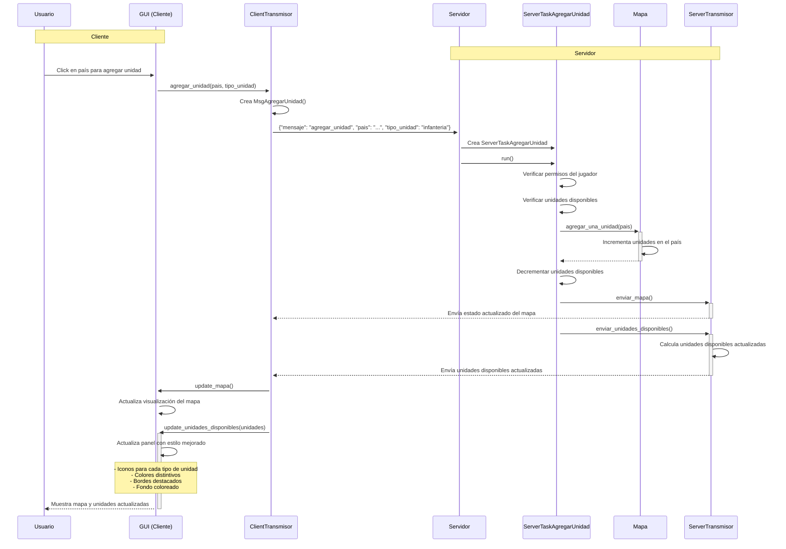

# Diagrama de Secuencia: Agregar Unidades

## Mejoras en el Estilo Visual

### Unidades Generales (Infantería)
- **Icono**: 🪖 (casco militar)
- **Color**: Verde (#2E7D32) cuando hay unidades disponibles
- **Fondo**: Verde claro (#E8F5E8) con borde verde (#4CAF50)

### Unidades de Continentes
- **Icono**: 🌍 (globo terráqueo)
- **Color**: Azul (#1565C0) cuando hay unidades disponibles
- **Fondo**: Azul claro (#E3F2FD) con borde azul (#2196F3)

### Misiles (si están disponibles)
- **Icono**: 🚀 (cohete)
- **Color**: Rojo (#D32F2F)
- **Fondo**: Rojo claro (#FFEBEE) con borde rojo (#F44336)

### Estados Sin Unidades
- **Color**: Gris (#666666)
- **Sin fondo especial**: Estilo minimalista

## Cómo visualizar este diagrama

Para ver este diagrama renderizado, puedes usar:
1. **GitHub/GitLab**: El diagrama se renderiza automáticamente
2. **VS Code**: Instala la extensión "Markdown Preview Mermaid Support"
3. **Online**: Copia el código en [mermaid.live](https://mermaid.live)
