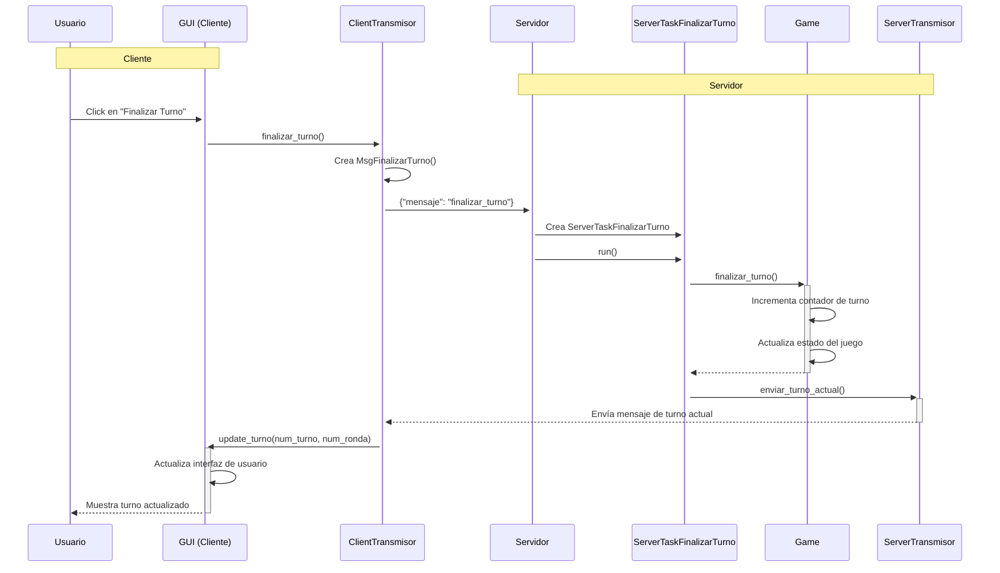

# Diagrama de Secuencia: Finalizar Turno

## Cómo visualizar este diagrama

1. **En VS Code**: Instala la extensión "Mermaid Preview" o "Markdown Preview Mermaid Support".
2. **En GitHub/GitLab**: El diagrama se renderizará automáticamente al ver el archivo .md
3. **En línea**: Usa el [editor de Mermaid Live](https://mermaid.live/)

## Componentes principales

1. **Cliente**:
   - `GUI`: Maneja la interfaz de usuario
   - `ClientTransmisor`: Envía mensajes al servidor

2. **Servidor**:
   - `Server`: Recibe y procesa mensajes
   - `ServerTaskFinalizarTurno`: Maneja la lógica de finalizar turno
   - `Game`: Contiene la lógica principal del juego
   - `ServerTransmisor`: Envía actualizaciones a los clientes
