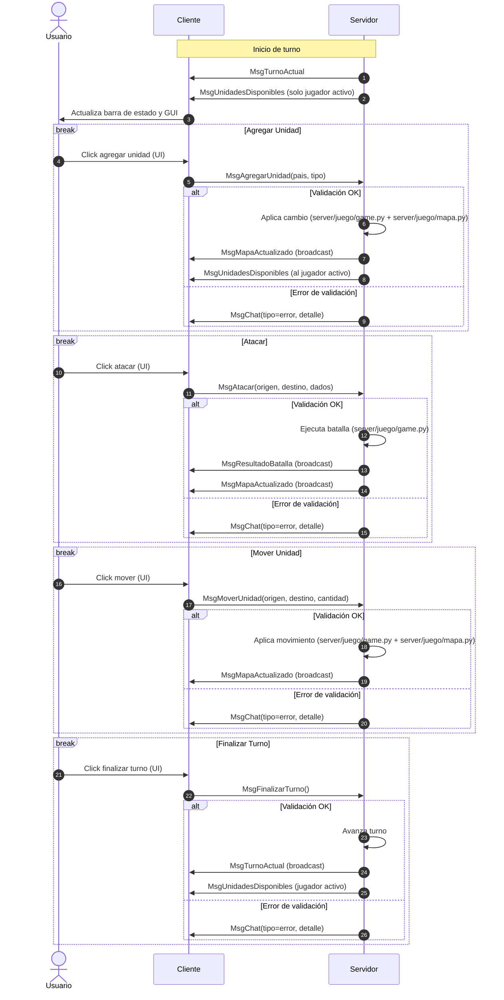

# Diagrama de flujo de mensajes

A continuación, un diagrama de secuencia (Mermaid) que resume los flujos principales de mensajes entre Cliente(s) y Servidor.

Notas
- Los mensajes de error siempre se publican en el chat del cliente como `MsgChat` con tipo `error`.
- El orden en ataques exitosos es: resultado de batalla -> actualización de mapa.
- Algunas notificaciones son broadcast (a todos los clientes) y otras dirigidas (solo al jugador activo).
